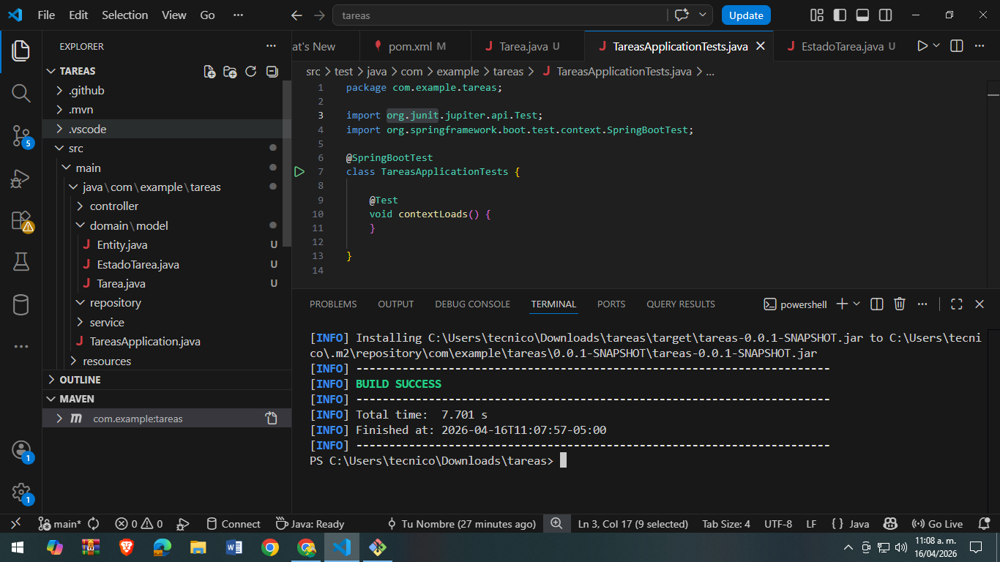
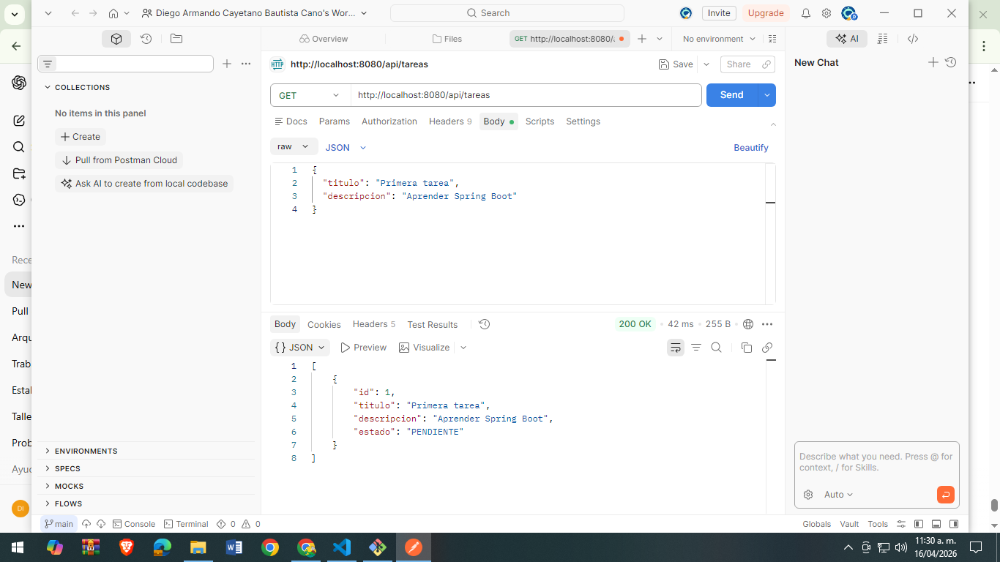
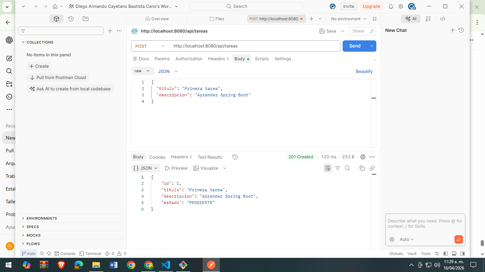
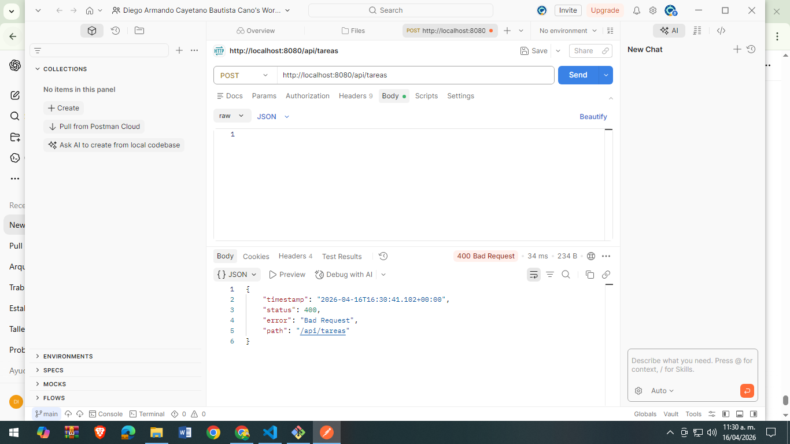
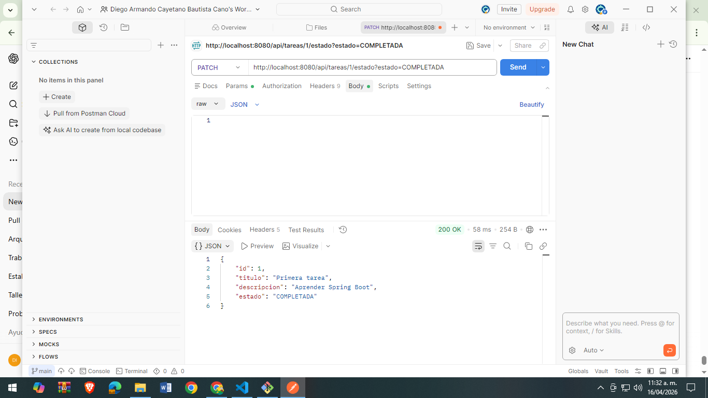
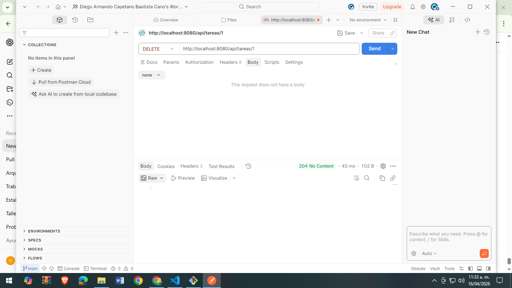

# 📌 Sistema de Gestión de Tareas - API REST

## 📚 Actividad: Patrones de Diseño de Software  
**Unidad 7 - Patrones Arquitectónicos I**  
Ingeniería de Sistemas - 2026

---

## 🎯 ¿Qué es esta actividad?

En esta actividad se desarrolla una **API REST para la gestión de tareas**, utilizando **Spring Boot** y aplicando una **arquitectura en capas estricta**.

El proyecto está organizado siguiendo buenas prácticas de desarrollo, separando responsabilidades para mantener un código limpio, ordenado y fácil de mantener.

---

## 🧠 ¿Qué se busca con esta actividad?

- Aplicar arquitectura en capas (Presentación, Servicio, Dominio e Infraestructura)
- Separar correctamente la lógica de negocio del manejo HTTP
- Usar Spring Boot para crear una API REST funcional
- Implementar operaciones CRUD básicas
- Manejar validaciones y errores de forma centralizada
- Usar una base de datos en memoria (H2)

---

## ⚙️ ¿Qué se hizo en el proyecto?

Se construyó un sistema de gestión de tareas donde se pueden:

- 📌 Crear tareas nuevas
- 📋 Listar todas las tareas
- 🔍 Buscar tareas por ID
- 🔄 Cambiar el estado de una tarea
- ❌ Eliminar tareas

El proyecto está dividido en capas:

- **Controller:** maneja las peticiones HTTP
- **Service:** contiene la lógica del sistema
- **Domain:** define las entidades (Tarea, EstadoTarea)
- **Repository:** acceso a base de datos con JPA

## 📸 Evidencias del funcionamiento

A continuación se muestran las capturas del sistema en ejecución:

### ▶ Ejecución del proyecto

---

### ▶ Operaciones REST

#### GET tareas

#### POST crear tarea

#### POST validación (vacío)

#### PATCH cambiar estado

#### DELETE tarea

---

## 👨‍💻 Conclusión

Este proyecto permite comprender cómo se estructura una API REST utilizando arquitectura en capas, mejorando la organización del código y facilitando su mantenimiento y escalabilidad.

## 📌 Autor

Diego Armando Cayetano Bautista Cano 
2026
